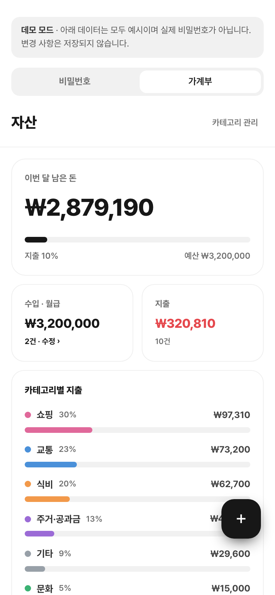
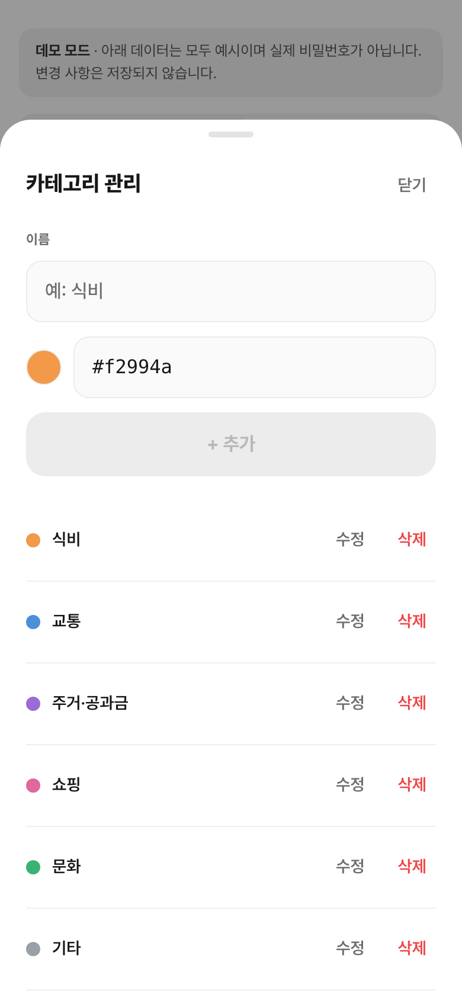
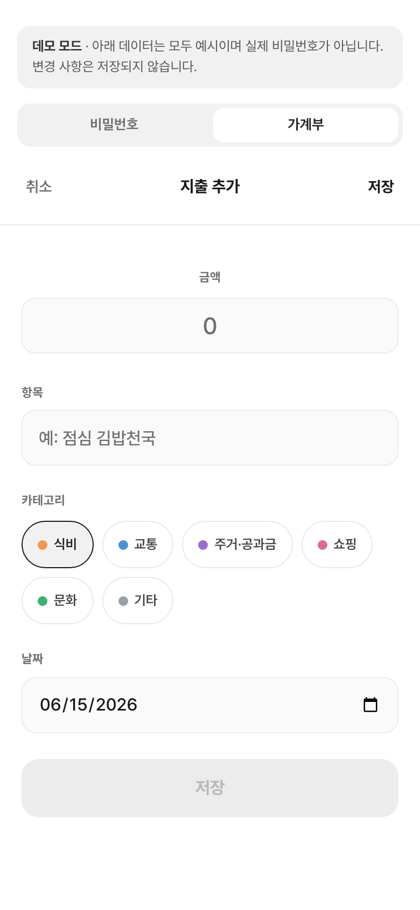

# 대외비

대외비는 여러 사이트의 비밀번호를 한곳에 모아 안전하게 보관하는 서비스이다. 사이트별로 정리해 두고 키워드로 빠르게 찾을 수 있으며, 아이디·비밀번호 외에 필요한 항목을 직접 만들어 기록할 수 있다. 지문·얼굴 인식으로 간편하게 열고, 저장한 내용은 본인만 볼 수 있다.

여기에 더해 **가계부(자산)** 기능을 제공한다. 매달 수입·지출을 기록하고, 카테고리를 직접 만들어(이름·색상) 분류하며, 남은 돈·카테고리별 분해·달력·일자 상세를 한눈에 본다. 금액·항목 등 가계부 본문도 비밀번호와 동일하게 본인만 볼 수 있도록 암호화해 보관한다.

## 미리보기

**비밀번호**

| 시작 | 목록 | 상세 | 추가 |
|:---:|:---:|:---:|:---:|
|  |  |  |  |

**가계부**

| 대시보드 | 카테고리 관리 | 지출 추가 |
|:---:|:---:|:---:|
|  |  |  |

## 데모

로그인 없이 둘러볼 수 있는 데모를 제공한다. 상단 **비밀번호 / 가계부** 탭으로 두 기능을 오가며, 비밀번호는 목록 → 상세 → 추가 흐름을, 가계부는 대시보드와 지출 추가·카테고리 관리를 직접 눌러볼 수 있다. 모든 데이터는 예시이며(실제 비밀번호가 아니다) 변경 사항은 저장되지 않는다.

👉 **<https://daeoebi.leejw.dev/demo>**

## 개발 환경

- Node.js 24
- pnpm (워크스페이스). 저장소 루트의 `mise.toml`에서 자동 설치할 수 있다(`node=24`, `pnpm=latest`).
- Docker (로컬 PostgreSQL 기동용)
- 프론트엔드. Next.js 15 (App Router) + React
- 백엔드. NestJS 10 + Prisma + PostgreSQL

## 프로젝트 구조

```
daeoebi/
├─ apps/
│  ├─ web/   Next.js 15 (App Router) — http://localhost:3010
│  └─ api/   NestJS 10 + Prisma + PostgreSQL — http://localhost:4010
├─ docs/
│  ├─ PRD.md      제품 요구사항 정의서
│  └─ DEPLOY.md   운영 배포 가이드(Cloudflare Tunnel + 단일 VPS)
├─ docker-compose.yml       운영 스택(postgres·api·web·cloudflared)
├─ docker-compose.dev.yml   로컬 PostgreSQL
├─ pnpm-workspace.yaml
└─ package.json (워크스페이스 스크립트)
```

## 설치 및 실행 방법

### 1. 의존성 설치와 환경 변수 설정

```bash
pnpm install
cp apps/api/.env.example apps/api/.env.development     # 환경 변수 설정
cp apps/web/.env.example apps/web/.env.development
```

### 2. 개발 서버 실행

```bash
make dev-up       # DB(도커) 기동 + 마이그레이션 + 웹·API(http://localhost:3010 / :4010) 동시 실행
```

자주 쓰는 명령은 다음과 같다.

```bash
make dev-migrate  # DB 마이그레이션
make typecheck    # 타입 검증
make lint         # 린트
make test         # 전체 테스트
make dev-down     # 서버·DB 종료 (데이터 유지)
```

전체 명령은 `make help` 로 확인한다.

## 보안 정책

- **인증.** passkey(WebAuthn) 기반 생체·기기 인증을 사용한다. 비밀번호 기반 로그인은 없다.
- **암호화.** 모든 항목 본문은 WebAuthn PRF로 도출한 키(AES-256-GCM)로 암호화한다. 제목만 평문이고 필드·메모는 하나의 payload로 직렬화돼 암호화된다.
- **키 보관.** 암호화 키는 서버에 저장하지 않고 잠금해제 세션 동안 메모리에만 둔다. 분실에 대비해 복구코드가 키를 추가로 래핑한다. 서버는 백업(export) 시점에도 본문을 복호화하지 않는다.
- **접근 제어.** 데이터 라우트(비밀번호: `/sites`·`/categories`·`/secrets`·`/search`·`/store`, 가계부: `/income`·`/expenses`·`/recurring`·`/asset-categories`)는 passkey 인증 가드 + CSRF(Origin 검증 + `X-Vault-Request` 헤더)로 보호한다. 비밀번호·가계부 본문 작업(생성·열람·수정)은 잠금해제(PRF 세션 키)를 추가로 요구한다.
- **무차별 대입 방어.** 복구코드 5회 연속 실패 시 60초 잠금이 발동하고, passkey 인증은 인증기 차원에서 무차별 대입을 차단한다.
- **운영 노출.** 외부 노출은 Cloudflare Tunnel 만 사용해 공개 인바운드 포트를 열지 않고 원본 IP를 숨긴다. 상세는 `docs/DEPLOY.md` 를 참고한다.
